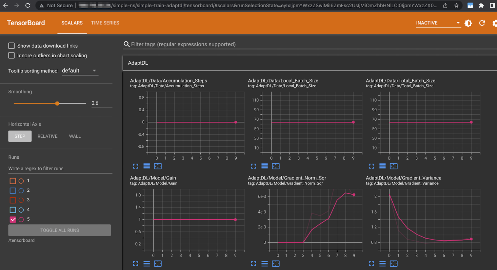
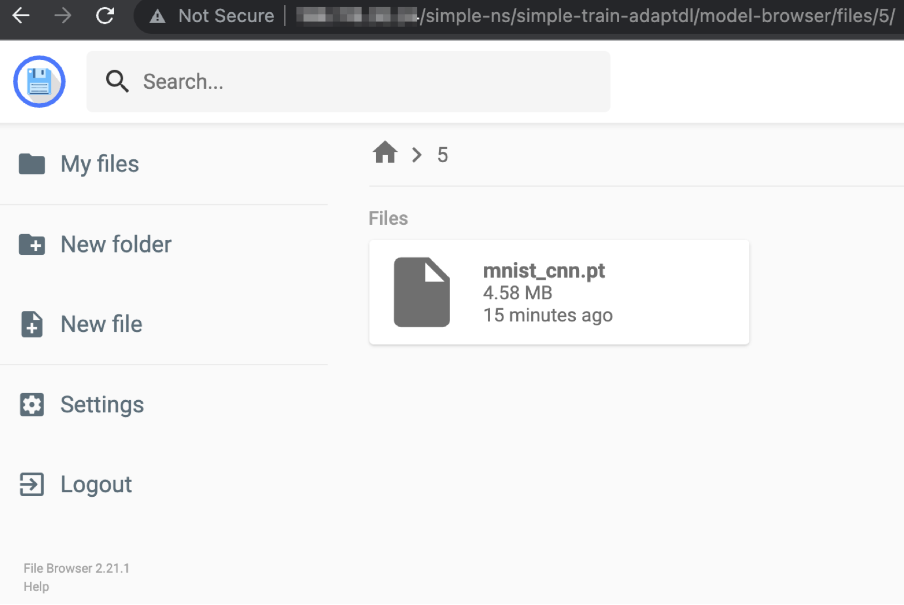

## Rampart System Components
The general concept of Rampart System Component and Graph is covered in {numref}`casl/rampart/docs/rampart_introduction:Rampart System Component and Graph`. This section provides reference to key System Components such as Rampart controller and AdaptDL.
### Rampart Controller
Rampart introduces a Kubernetes Custom Resource Definition(CRD) named RampartGraphs to represent Rampart Graphs. The Rampart controller is responsible for its handling when a Rampart Graph is created.
#### RampartGraphs and Its Handling
RampartGraphs are the specifications for Rampart Graphs to be deployed on a Kubernetes cluster. To that end, they contain the following information:
- Standard Kubernetes metadata (name, namespace, labels, annotations, etc.)
- Graph specification
- Graph status

The metadata is generally the same as the metadata for all other Kubernetes objects. However, there are two noteworthy exceptions. First, the name is limited to 63 characters, as it is used as a label. Second, the metadata defines the namespace in which components will be deployed. Each component will be deployed in namespace `<namespace>-<graph_name>-<component_name>`.

The graph specification defines the components and flows in the graph, and the edges between them. The general format is as follows:
```yaml
metadata: <...>
spec:
  graph:
    components:
      <component-1-name>:
        chart:
          name: <helm-chart-name>
          repo: <helm-chart-remote-repository>
          version: <helm-chart-version>
        config:
          <yaml of values to be passed to helm for deployment>
        inputs:
          <name of input edge (to be used internally by the component)>:
            flow: <flow-name>
            type: <flow-type>
        outputs: <same as inputs>
    flows:
      <flow-1-name>:
        type: <type of the flow>
        config: <yaml containing volume size, etc.>
```
During creation of the graph object, the Rampart controller will reject well-formed but invalid graphs, such as those with inaccessible helm charts, those with input/output references to flows that do not exist, or those with missing fields.

The values specified in `chart.repo` can either be a URL to a helm repository, or it may be the name of a Kubernetes secret in the graph or rampart controller namespaces that contains the url in the data in field `url`. Any other helm arguments for pulling charts, like username and password, may be contained in appropriate fields in the secret.

Please note that the components and flow fields are dictionaries.

Upon graph creation, the Rampart controller will update cluster state to include the graph. Helm charts for each component will be deployed, and flows will be created to connect them. The status field in the graph will be updated to reflect the status of the deployment. For example, if component installation fails, then the graph status will be updated with "failed".

Graphs may be updated with new specifications, in which case the controller will deploy, delete or modify deployed components as necessary.

The controller will also modify all the pod specifications that do not have the label rampart-disable-edges and are within the component namespaces to attach the connections to the appropriate flows. In particular, the appropriate volumes will be mounted, and environment variables will be set to allow access to the volume mounts or connect to the pulsar endpoint.

Graph deletion does not use helm for teardown. Instead, all deployed objects should be contained within the release namespace, inside a namespace anchored in the release namespace, or a cluster-scoped object. For the former two, deletion of child objects is automatic via Kubernetes, and for the latter, owner references to the release namespace are injected during deployment. Any object not belonging to those three categories may become orphaned after graph deletion.
### AdaptDL
AdaptDL is a resource-adaptive deep learning (DL) training and scheduling framework. The goal of AdaptDL is to make distributed DL easy and efficient in dynamic-resource environments such as shared clusters and the cloud. AdaptDL scheduler can be used through Rampart Components to build end to end training/retraining pipelines which can make use of its scheduling capabilities.

AdaptDL consists of two components which can be used together with or separately from one another:
- **adaptdl-sched**

  A cluster scheduler on Kubernetes optimized for distributed deep learning training.

- **Adaptdl**

  A library for adaptive batch sizes that can efficiently scale distributed training to many nodes.

Some core features offered by AdaptDL are:

- Elastically schedule distributed DL training jobs in shared clusters.
- Cost-aware resource auto-scaling in cloud computing environments (e.g. AWS).
- Automatic batch size and learning rate scaling for distributed training.

AdaptDL currently supports PyTorch training programs. You can check out full AdaptDL documentation at <https://adaptdl.readthedocs.io/en/latest/> and the open-source implementation at <https://github.com/petuum/adaptdl>

We will build on the `mnist-train` model from the `simple-train` graph that we defined in {numref}`casl/rampart-helm/docs/training_retraining:Model Training and Visualization`. First, you need to convert the model code to use the AdaptDL user library API, which essentially wraps the model and the dataloaders. Through these APIs AdaptDL scheduler can collect performance metrics and make batch scaling and replica scaling decisions on behalf of the job, as well as adjust the LR automatically. Once the model is launched as an AdaptDLJob it can automatically scale to multiple replicas based on scalability of the model and available resources, mainly GPUs.
```diff
+    import adaptdl
+    import adaptdl.torch as adl
     device = torch.device("cuda" if use_cuda else "cpu")
+    adl.init_process_group("nccl" if torch.cuda.is_available()
+                           else "gloo")
     writer = SummaryWriter("/tensorboard")
-    train_loader = torch.utils.data.DataLoader(dataset1,**train_kwargs)
-    test_loader = torch.utils.data.DataLoader(dataset2, **test_kwargs)
+    train_loader = adl.AdaptiveDataLoader(dataset1,**train_kwargs)
+    test_loader = adl.AdaptiveDataLoader(dataset2, **test_kwargs)
     model = Net().to(device)
     optimizer = optim.Adadelta(model.parameters(), lr=args.lr)
     scheduler = StepLR(optimizer, step_size=1, gamma=args.gamma)
-    for epoch in range(1, args.epochs + 1):
+
+    model = adl.AdaptiveDataParallel(model, optimizer, scheduler)
+    for epoch in adl.remaining_epochs_until(args.epochs):
         train(args, model, device, train_loader, optimizer, epoch, writer)
         test(model, device, test_loader, writer)
```
Then we build, tag and push this image:
```bash
docker build -f Dockerfile . -t registry.foo.com/dev/mnist-train-adaptdl:latest
docker push registry.foo.com/dev/mnist-train-adaptdl:latest
```
This image will be later used in RampartGraph yaml definition. The RampartGraph now needs to start `adaptdl-launcher` (which is a built-in component) which launches the AdaptDL job that we have built above. The name and tag of the image is conveyed to the launcher through the environment variable `ADAPTDL_IMAGE`. Here’s the modified trainer component:
```yaml
     trainer:
        chart:
          name: batch-executor
          repo: rampart-repo
          version: 0.6.0
        config:
          image:
            repository: registry.petuum.com/dev/rampart/batch-executor
            tag: debug
          imagePullSecrets:
            - name: stagingsecret
          jobConfig:
            image:
              repository: petuum.jfrog.io/petuum-harbor/dev/adaptdl-launcher
              tag: 0.1.0
              pullPolicy: Always
            imagePullSecrets:
              - name: stagingsecret
            env:
              - name: ADAPTDL_IMAGE
                value: registry.foo.com/dev/mnist-train-adaptdl:latest
            inputMap:
              input_1: /data/MNIST/raw
            outputMap:
              output_1: /model
              tensorboard_output: /tensorboard
```
AdaptDL logs a lot of metrics like batch size, LR etc. to Tensorboard which can be viewed through a similar method described in {numref}`casl/rampart-helm/docs/training_retraining:Model Training and Visualization`.

Anything the user logs will also be available through the same Tensorboard URL. The final model can be downloaded through the file-browser like before

